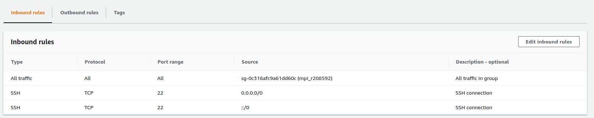

### Configurando uma máquina para geração da imagem
1. Entrar no console AWS
2. Selecione o serviço **EC2**
3. Clique em "Launch Instance"
4. Selecione a imagem:
	_Ubuntu Server 18.04 LTS (HVM), SSD Volume Type - ami-085925f297f89fce1 (64-bit x86) / ami-05d7ab19b28efa213 (64-bit Arm)_
5. Clique em "Select"
6. Selecione uma instância do tipo **t2.medium**
7. Clique em "Configure Instance Details"
8. Em "Advanced Instance Details", no campo "User data", cole os comandos "As text":
```
#!/bin/bash
sudo apt-get update
sudo apt-get install -y wget make cmake gcc libgfortran3 \
sysstat libibnetdisc-dev openmpi-bin libopenmpi-dev \
libhdf5-openmpi-dev gfortran build-essential git
```
9. Clique em "Add Storage"
10. Clique em "Add Tags"
11. Clique em "Configure Security Groups"
12. Clique em "Review and Launch"
13. Clique em "Launch"
14. Uma tela abrirá, se você já possui uma chave de acesso, basta selecioná-la. Caso contrário é necessário criar uma nova chave e fazer o download na sequência, pois essa chave será usada para acessar as máquinas criadas
15. Em seguida clique em "Launch Instances" para criar a VM

### Conectando na instância criada
1. Com a instância criada selecione-a e clique no botão "Connect"
2. Uma tela abrirá e nela terá um comando de exemplo, copie e execute no diretório que você tem a chave de acesso salva

### Configurando a chave RSA
1. Dentro da VM gere a chave de acesso usando o comando:
```
ssh-keygen
```
2. Digite "enter" para todos os campos requisitados
3. Na sequência use o comando para autorizar a chave criada:
```
cat ~/.ssh/id_rsa.pub >> ~/.ssh/authorized_keys
```

### Trasferindo, compilando e executando o GROMACS
1. Clone o repositório _gromacs_ usando o comando:
```
git clone -b ativ-5-exp-1 https://github.com/rodrigorusa/gromacs-mo833a.git
```
2. Entre na pasta _gromacs-mo833a/experiments/ativ-5-exp-1_
3. Execute o script **build.sh** para compilar a aplicação
4. Aguarde o término da compilação
5. Execute o script **create_simulation.sh** para gerar a simulação
6. Saia da máquina

### Criando a imagem base
1. Selecione a máquina virtual criada anteriormente
2. Na opção "Actions - Image", Selecione a opção "Create Image"
3. Adicione um nome e uma descrição a imagem e clique no botão "Create Image"
4. Após alguns instances a imagem estará criada

### Configurando a rede de interconexão
1. Na seção de "Security Groups", clique em "Create Security Group"
2. Solicite apenas a liberação SSH da porta 22 a partir de qualque lugar
3. Atenção para a VPC selecionada, ela deve ser a mesma usada no momento da criação da máquina
4. Com o grupo de segurança criado, selecione-o e clique no botão "Actions", selecione a opção "Edit inbound rules"
5. Crie uma nova regra que libere todo o tráfico entre máquinas pertencentes aquele grupo, selecione "Add Rule" e preencha os campos. No campo "source" selecione o grupo criado
6. Ao final o grupo deve ficar com a configuração semelhante a da imagem

> Configuração esperada do grupo

### Selecionando e configurando múltiplas instâncias
1. Selecione o serviço **EC2**
2. Clique em "Launch Instance"
3. Selecione a imagem base criada em "My AMIs"
4. Clique em "Select"
5. Selecione uma instância do tipo **c5.large**
6. Clique em "Configure Instance Details"
7. Em "Number of instances" coloque 2
8. Em "Placement group" marque a opção "Add instance to placement group"
    1. Crie um novo grupo ou selecione um grupo existente, dê preferência ao uso de grupo "cluster"
9. Clique em "Add Storage"
10. Clique em "Add Tags"
11. Clique em "Configure Security Groups"
    1. Selecione o grupo criado no passo anterior
12. Clique em "Review and Launch"
13. Clique em "Launch"
14. Uma tela abrirá, se você já possui uma chave de acesso, basta selecioná-la. Caso contrário é necessário criar uma nova chave e fazer o download na sequência, pois essa chave será usada para acessar as máquinas criadas
15. Em seguida clique em "Launch Instances" para criar a VM

###  Executando o GROMACS com MPI
1. Selecione uma das instâncias criadas e clique no botão "Connect"
2. Uma tela abrirá e nela terá um comando de exemplo, copie e execute no diretório que você tem a chave de acesso salva. Se o usuário for _root_, troque por _ubuntu_
3. Crie um arquivo chamado _hostfile_ com os IPs das duas máquinas criadas
    1. Entre na pasta _gromacs-mo833a/experiments/ativ-5-exp-1_
    2. Para obter o IP das máquinas, selecione a máquina no "Dashboard" do EC2
    3. Na aba "Description", o campo "Private IPs" terá o IP da máquina
    4. Em seguida crie o arquivo utilizando os comandos:
```
echo "<IP1> slots=2" > hostfile
echo "<IP2> slots=2" >> hostfile
```
4. Com o arquivo de IPs criado, execute a aplicação usando o comando:
```
mpirun -np 4 --hostfile hostfile ../../build/bin/gmx_mpi mdrun -v -deffnm em
```
5. Aguarde o processamento finalizar
6. Saia da VM
7. Pare a máquina ou termine-a caso não for utilizá-la mais