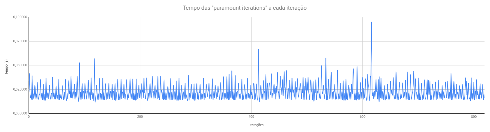

# Reportando a Paramount Iteration
_Autor: Rodrigo Rusa - RA 208592_
_Data: 08 de maio de 2020_

### Introdução
O objetivo desse experimento é identificar no código do _GROMACS_ a região de código que melhor caracteriza uma _paramount iteration_ e em seguida instrumentar o código para medir o tempo de cada _paramount iteration_ ao longo da execução da aplicação. 

### Metodologia
Para esse experimento o código foi instrumentado seguindo a modificação <https://github.com/rodrigorusa/gromacs-mo833a/commit/b2dfcf99177aed421c9b2c7064b799b1ba5482b3>. Nessa instrumentação é medido o tempo de inicialização da aplicação, ou seja, o tempo desde o início da função _main_ até o início da primeira _paramount iteration_ e também o tempo de cada _paramount iteration_ ao longo da execução. O experimento foi executado em uma máquina com CPU Intel i7-7700 3.60GHz, Memória de 16GB, HD, Sistema Operacional Ubuntu 18.04.4 LTS e Compilador GCC/XX 7.5.0. Uma planilha com os resultados observados pode ser encontrado em <https://docs.google.com/spreadsheets/d/1QUlVUhwVZ_bVvFkw7zGvKR91QPaoY1gJLM8hkJkVDts/edit?usp=sharing>

### Resultados
O gráfico a seguir ilustra o tempo de cada _paramount iteration_ ao longo da execução da aplicação obtido no experimento realizado.

Podemos ver que o tempo de execução das _paramount iterations_ apresenta pequena variação ao longo das iterações. Analisando o dado coletado podemos extrair a seguintes informações:
Média | 0,022402
------------ | -------------
**Mediana** | **0,020883**
**Desvio Padrão** | **0,008231**
**Tempo de Inicialização** | **0,080804**
**Tempo de Finalização** | **0,047769**
**Número de Iterações** | **820**
**Tempo Total (real)** | **18,500118**
Para verificar se a _paramount iteration_ identificada é realmente uma _paramount iteration_, ou seja, se podemos obter uma boa estimativa de tempo de execução da aplicação sem executá-la por completo utlizando apenas o tempo de execução das _paramount iterations_, podemos fazer uma predição do tempo total de execução da aplicação com base nas _paramount iterations_ e comparar com o tempo total da aplicação medido. Assim, utilizando a média do tempo de execução de cada _paramount iteration_ temos que:
```
predição = tempo de inicialização + número de iterações*média paramount iterations + tempo de finalização
predição = 0,080804 + 820*0.022402 + 0.047769
predição = 18,498099 segundos
```
Podemos ver que o valor predito é muito próximo ao valor real medido. Dessa forma podemos concluir que a _paramount iteration_ identificada pode ser utilizada para estimar o tempo total de execução da aplicação.