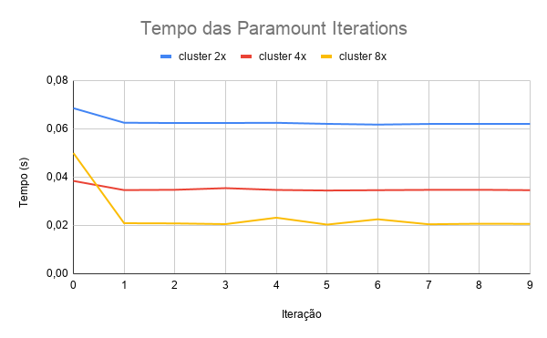

# Executando o GROMACS com o CLAP
_Autor: Rodrigo Rusa - RA 208592_
_Data: 21 de maio de 2020_

### Introdução
O objetivo desse experimento foi desenvolver _scripts_ utilizando a ferramenta CLAP (CLoud Application Platform) para automatizar a criação de nós computacionais e executar a aplicação gmx do _GROMACS_ modificada para reportar o tempo das _paramount iterations_ (Atividade 6 <https://github.com/rodrigorusa/gromacs-mo833a/tree/ativ-6-exp-1/experiments/ativ-6-exp-1>).

### Metodologia
Para esse experimento inicialmente o código foi instrumentado para terminar a execução após 10 iterações como ilustrado a seguir:
```
// Stop loop with 10 iterations
if(count == 10) {
    bDone = TRUE;
}
```
Em seguida a ferramenta CLAP foi instalada seguindo o tutorial <https://clap.readthedocs.io/en/latest/introduction.html>. Com o CLAP instalado foi realizado a configuração básica do ambiente definindo um provedor aws, _login_ e uma instância como descrito no tutorial <https://clap.readthedocs.io/en/latest/configuration.html>. Para esse experimento uma instância do tipo **t2.micro** foi utilizada. Para o correto funcionamento do experimento é necessário que a instância declarada esteja em um _security group_ específico. Para criar esse _security group_ foi seguido os passos descritos em <https://github.com/rodrigorusa/gromacs-mo833a/tree/ativ-5-exp-1/experiments/ativ-5-exp-1> na seção "Configurando a rede de interconexão".

O próximo passo foi definir um grupo chamado _GROMACS_ no CLAP e nele foram definidas as ações:
* _setup_
* _simulation-setup_
* _hostfile-setup_
* _keys-setup_
* _run_
* _fetch-results_

A ação _setup_ é ação a responsável por instalar dependências, gerar uma chave RSA, clonar o repositório e compilar o _GROMACS_. A segunda ação, _simulation-setup_, é responsável por criar os dados da simulação que será executada a partir do dados de entrada. A _hostifile-setup_ é a ação que cria um arquivo de chamado _hosts_ contendo os IPs dos nós que serão utilizados na execução da aplicação. Para finalizar o _setup_ do cluster, é definida a ação _keys-setup_ que adiciona a chave RSA gerada em cada nó na ação _setup_ no arquivo _~/.ssh/authorized_keys_ de todos os nós, permitindo que os nós tenham acesso entre eles. Por fim essa ação cria um arquivo chamado _config_ no diretório _~/.ssh/_ para desabilitar a verificação de conexão confiável entre os nós. Todas essa ações descritas anteriormente são executadas em todos os nós do cluster.

Por fim, são definidas as ações _run_ que executa a aplicação gmx do _GROMACS_ utilizando MPI e a ação _fetch-results_ que faz o _download_ dos resultados para uma máquina local. Essas duas ações são executadas apenas no nó master do _cluster_.

Nesse experimento foram criados três configurações de _cluster_:
* _cluster-t2.micro-2x_: cluster com dois nós do tipo **t2.micro**
* _cluster-t2.micro-4x_: cluster com quatro nós do tipo **t2.micro**
* _cluster-t2.micro-8x_: cluster com oito nós do tipo **t2.micro**

Para cada configuração foi definido um nó como sendo o nó _master_ e o restante como nós _slaves_ como ilustrado no _cluster-t2.micro-2x_ a seguir:
```
setups:
  config-node-master:
    groups:
    - name: gromacs/master

    actions:
    - type: action
      name: simulation-setup
      group: gromacs

  config-node-slave:
    groups:
    - name: gromacs/slave

    actions:
    - type: action
      name: simulation-setup
      group: gromacs
  
  final-config:
    actions:
    - type: action
      name: hostfile-setup
      group: gromacs

    - type: action
      name: keys-setup
      group: gromacs
      
clusters:
  cluster-t2-micro-2x:
    after_all:
    - final-config

    nodes:
      node-master:
        type: user4-instance
        count: 1
        min_count: 1
        setups: 
        - config-node-master
      node-slave:
        type: user4-instance
        count: 1
        min_count: 1
        setups: 
        - config-node-slave
```

Assim, para executar o experimento basta criar uma pasta chamada _ssh_keys_ no diretório _~/.clap/_ na máquina local e executar os seguintes comandos do CLAP:
```
clapp cluster start --no-setup cluster-t2-micro-[2,4 ou 8]x
clapp cluster setup <cluster-id>
clapp cluster action <cluster-id> gromacs run
clapp cluster action <cluster-id> gromacs fetch-results
```

Após a execução dos comandos o resultado do experimento pode ser encontrado nos arquivos _~/.clap/<node-master-id>\_gmx.out_ e _~/.clap/<node-master-id>\_gmx.err_.

### Resultados
A seguir é ilustrado o gráfico obtido com a execução da aplicação nos três _clusters_ definidos:


A seguir são ilustrados os tempos de cada _paramount iteration_ em cada _cluster_ executado e uma estimativa do tempo de execução total da aplicação considerando um número total de 820 iterações (obtido no experimento <https://github.com/rodrigorusa/gromacs-mo833a/tree/ativ-6-exp-1/experiments/ativ-6-exp-1>).

##### Cluster 2x
#
| Iteração |  Paramount time(s) | Tempo Total(s) |
|:--------:|:------------------:|:--------------:|
| 0        | 0,068531           | 56,19542       |
| 1        | 0,062511           | 51,25902       |
| 2        | 0,062395           | 51,16390       |
| 3        | 0,062403           | 51,17046       |
| 4        | 0,062480           | 51,23360       |
| 5        | 0,062044           | 50,87608       |
| 6        | 0,061739           | 50,62598       |
| 7        | 0,062008           | 50,84656       |
| 8        | 0,062041           | 50,87362       |
| 9        | 0,062039           | 50,87198       |

##### Cluster 4x
#
| Iteração |  Paramount time(s) | Tempo Total(s) |
|:--------:|:------------------:|:--------------:|
| 0        | 0,038432           | 31,51424       |
| 1        | 0,034635           | 28,40070       |
| 2        | 0,034756           | 28,49992       |
| 3        | 0,035440           | 29,06080       |
| 4        | 0,034699           | 28,45318       |
| 5        | 0,034465           | 28,26130       |
| 6        | 0,034607           | 28,37774       |
| 7        | 0,034729           | 28,47778       |
| 8        | 0,034760           | 28,50320       |
| 9        | 0,034601           | 28,37282       |

##### Cluster 8x
#
| Iteração |  Paramount time(s) | Tempo Total(s) |
|:--------:|:------------------:|:--------------:|
| 0        | 0,049964           | 40,97048       |
| 1        | 0,020929           | 17,16178       |
| 2        | 0,020847           | 17,09454       |
| 3        | 0,020549           | 16,85018       |
| 4        | 0,023207           | 19,02974       |
| 5        | 0,020358           | 16,69356       |
| 6        | 0,022556           | 18,49592       |
| 7        | 0,020493           | 16,80426       |
| 8        | 0,020716           | 16,98712       |
| 9        | 0,020651           | 16,93382       |

Os resultados obtidos podem ser encontrados no diretório _/results_ ou na planilha <https://docs.google.com/spreadsheets/d/1kMa-5sYVLRg5XLgyenYUUyyxoeyu4TE_2xIoJL59gkI/edit?usp=sharing>